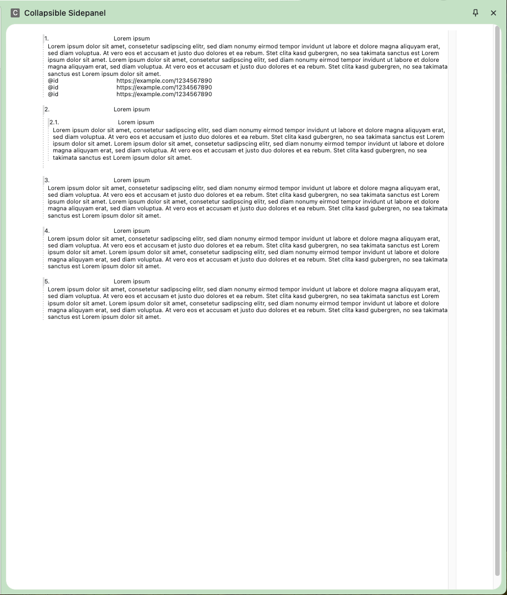
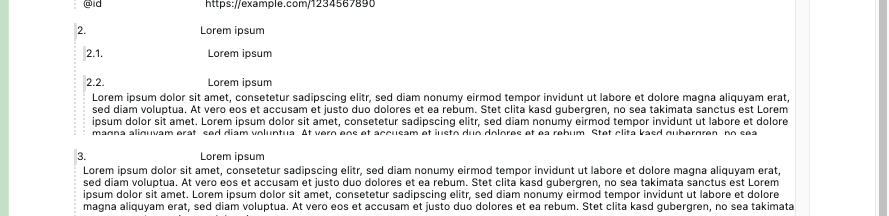

# Test Case for Chrome Sidepanel with Materialize CSS - Collapsibles

This is a test case for a Chrome extension that uses the side panel feature with Materialize CSS. The side panel contains a collapsible component that can be expanded and collapsed.

However, the collapsible does not render correctly. As you can see in the screenshot below, the inital height of the list is too small. It does not extend to the bottom of the viewport. It cuts off the collapsibles 6. - 11. Even scrolling is not possible.

Further the nested collapsible items under 2. are not cropped as well. When you close the section 2.1 2.2 appears. See screenshot below.

